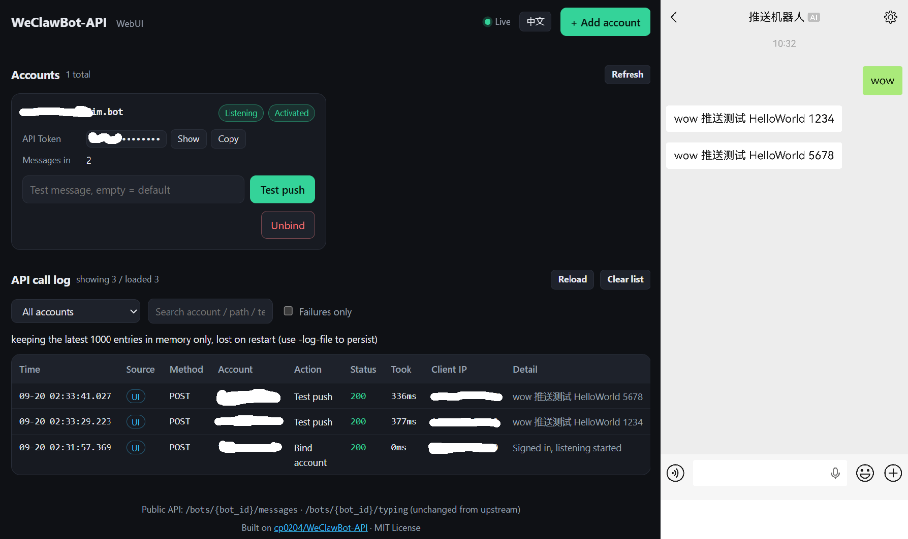

# WeClawBot-API-WebUI

[中文](README.md) | English

An extended version of [cp0204/WeClawBot-API](https://github.com/cp0204/WeClawBot-API): **the same HTTP API, plus a built-in WebUI**.

Add accounts by scanning a QR code, unbind them, send test pushes and read the API call log — all from the browser, no more `docker exec` into the container.



> Tiny and self-contained, like upstream: the frontend is a single HTML file (plain JS, no build step, no third-party libraries) embedded into the binary with `go:embed`, and QR codes are generated server-side by `rsc.io/qr`. The whole project depends on exactly one module (`rsc.io/qr`; upstream has four).

## Attribution

Based on [cp0204/WeClawBot-API](https://github.com/cp0204/WeClawBot-API) ([MIT License](https://github.com/Cp0204/WeClawBot-API/blob/main/LICENSE)).
Also references [Tencent/openclaw-weixin](https://github.com/Tencent/openclaw-weixin) ([MIT License](https://github.com/Tencent/openclaw-weixin/blob/main/LICENSE)).

This project also depends on a third-party Go component (`rsc.io/qr`, BSD 3-Clause).
Its copyright notice and full license text are in
[THIRD_PARTY_NOTICES.md](THIRD_PARTY_NOTICES.md); ship that file alongside any binary or image.

## Compatibility with upstream

- The public API `/bots/{bot_id}/messages` and `/bots/{bot_id}/typing` is **unchanged** — existing callers keep working.
- The `config` directory format is **unchanged** — mount your existing volume and you are done, no need to scan again.
- The upstream console commands (`/login`, `/bots`, `/bot`, `/del`) are gone; use the WebUI instead. Running the program a second time (the usual `docker exec`) no longer starts a second instance: it detects that the port is taken, prints a short notice and exits.

## Features

On top of upstream (multiple accounts, QR login, persistent storage, HTTP API):

- **Add accounts by scanning a QR code** in the browser — credentials are saved and the listener starts immediately
- **Unbind accounts** — stops that account's listener and removes its config (disconnect it in WeChat yourself)
- **Test push** — send yourself a test message from the account card, see whether it worked and how long it took
- **API call log** — every call made to this service (client IP, account, action, status, duration, message excerpt), streamed live over SSE, filterable by account / keyword / failures only; optionally persisted as JSONL with `-log-file`
- **Account cards** — BotID, API Token (masked, one-click copy), activation state, listener state, incoming message count
- **Access control for the admin side** — HTTP Basic password, localhost/private networks only, password-failure lockout (5 attempts, then 5→60 minutes), CSRF protection. **The public API `/bots/*` is not affected** and still authenticates with `api_token`
- **Bilingual UI** — Chinese and English, chosen from your browser language, switchable in the header

## Install

Releases ship image packages for both architectures. No Go toolchain and no internet access needed on the NAS/server:

```bash
uname -m                        # x86_64 → the x86-64 package, aarch64 → the arm64 one
docker load -i WeClawBot-Api-WebUI_Docker_<version>_<arch>.tar.gz
docker run -d --name weclawbot-api-webui --network bridge \
  -p 26322:26322 -v ./config:/app/config \
  --restart unless-stopped weclawbot-api-webui:<version>
```

Flags: `-port` (default 26322) · `-log-file <path>` (append the call log as JSONL) · `-log-size` (in-memory entries, default 1000) · `-no-auth` · `-trust-cidr <cidr>` · `-allow-public`

Environment: `WEBUI_USER` (WebUI username, default `admin`) · `WEBUI_PASSWORD` (WebUI password)

```bash
# with your own username and password
docker run -d --name weclawbot-api-webui --network bridge \
  -p 26322:26322 -v ./config:/app/config \
  -e WEBUI_USER=admin -e WEBUI_PASSWORD=your-password \
  --restart unless-stopped weclawbot-api-webui:<version>
```

Setting neither works as well: the username defaults to `admin`, and a random password is printed in the startup log (and stored in `config/webui.json`, so it survives restarts).

## Using the WebUI

Open `http://<your-ip>:26322/`. The UI language follows your browser language — switch it with the button in the header.

## Security

The admin side (the page and `/admin/api/*`) sits behind four gates: a password (HTTP Basic, prompted natively by the browser), a localhost/private-network-only source check, password-failure lockout (5 attempts, then 5→60 minutes), and CSRF protection.

- Password sources: the `WEBUI_PASSWORD` env var → `config/webui.json` → otherwise a random one is generated and printed **once** in the startup log (and written to that file)
- Forgot it: delete `config/webui.json` and restart, or set `WEBUI_PASSWORD`
- The source check looks only at the TCP peer address and **deliberately ignores `X-Forwarded-For`** (clients can forge that header); unparsable peers are rejected. If you get a 403 (Tailscale, reverse proxy), add the peer network with `-trust-cidr <cidr>`
- **The public API `/bots/*` is not behind any of this** — it authenticates with `api_token` and may be called from any network
- Browsers cache the credentials until the window is closed; there is no logout button. To revoke access immediately, change the password and restart the container
- `-no-auth` turns the password off (the source check still applies); `-allow-public` disables the source check — **not recommended**

> [!WARNING]
> HTTP is plain text — **do not expose port 26322 to the internet**. For access from untrusted networks, put it behind a reverse proxy with HTTPS.

## API

Accepts `GET` and `POST`, with `application/json`, `application/x-www-form-urlencoded` or `multipart/form-data`.

### Authentication

Every endpoint requires the `api_token` (copy it from an account card in the WebUI, or read `config/auth.json`).

Pass it either way:

- **Header**: `Authorization: Bearer <api_token>`
- **Body/Query**: `token=<api_token>`

> This is the **public API authentication and is separate from the WebUI password**: `api_token` is only used for `/bots/*`; signing in to the admin UI uses the Basic password (see Security above).

### Send a message

**Endpoint:** `/bots/{bot_id}/messages`

**Parameter:** `text`

```bash
curl "http://192.168.8.8:26322/bots/{xxx@im.bot}/messages?token={api_token}&text=Hello"
```
```bash
curl -X POST http://192.168.8.8:26322/bots/{xxx@im.bot}/messages \
  -H "Content-Type: application/json" \
  -H "Authorization: Bearer {api_token}" \
  -d '{"text": "Hello, this is a POST request!"}'
```

### Send a typing state

**Endpoint:** `/bots/{bot_id}/typing`

**Parameter:** `status` — `1` typing, `2` stopped typing

```bash
curl "http://192.168.8.8:26322/bots/{xxx@im.bot}/typing?token={api_token}&status=1"
```

### Response format

Success:
```json
{ "code": 200, "message": "OK" }
```
Error:
```json
{ "code": 401, "error": "Unauthorized" }
```

## WebUI admin API

Called by the page itself. All of them need the WebUI password (the same four gates) plus the `X-WebUI: 1` header.

| Method | Path | Description |
| --- | --- | --- |
| `GET` | `/` | WebUI page |
| `GET` | `/admin/api/bots` | Account list (token, activation, listener state, incoming count) |
| `DELETE` | `/admin/api/bots/{bot_id}` | Unbind an account |
| `POST` | `/admin/api/bots/{bot_id}/test` | Test push, JSON body `{"text":"..."}` |
| `POST` | `/admin/api/login/start` | Start a QR login, returns a login session id |
| `GET` | `/admin/api/login/qr?id=` | Login QR code as PNG |
| `GET` | `/admin/api/login/status?id=` | Login state: `wait` / `scaned` / `confirmed` / `failed` |
| `GET` | `/admin/api/logs?limit=&since=` | Call log (newest first) |
| `GET` | `/admin/api/logs/stream` | Call log as an SSE stream |
| `GET` | `/admin/api/i18n` | Available UI languages + the default one |
| `GET` | `/admin/api/i18n/{lang}` | UI strings for one language (falls back to the default) |

Errors carry a stable `error_code` (`auth_required`, `too_many_failures`, `bot_not_activated`, …) next to the human-readable `error`, so the UI can render them in the current language.

## FAQ

**"Test push" says the account is not activated**
The server has no reply context for that account yet. Send a message to `微信ClawBot` in WeChat first; once the badge on the account card turns to "Activated" you can push.

**The call log shows a lot of 401 Unauthorized**
Wrong or missing `api_token`. Copy it with the "Copy" button on an account card; it is accepted as `Authorization: Bearer <token>` or `token=<token>`.

**The log does not stream live behind a reverse proxy**
SSE needs proxy buffering disabled. The code already sends `X-Accel-Buffering: no` (Nginx honours it); other proxies (Nginx `proxy_buffering`, Caddy, Synology reverse proxy, …) may need it turned off manually.
