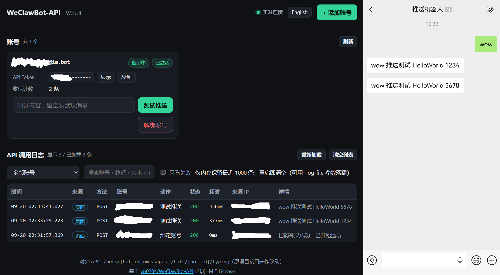

# WeClawBot-API-WebUI

[English](README.en.md) | 中文

在 [cp0204/WeClawBot-API](https://github.com/cp0204/WeClawBot-API) 基础上扩展出来的版本：**保留原有的 HTTP API，额外提供一个内置的 WebUI**。

在网页上就能完成扫码添加账号、解绑账号、测试推送、查看 API 调用日志，不用再 `docker exec` 进容器敲命令。



> 体积极小、独立运行：前端是单个 HTML 文件（原生 JS、无构建、无第三方库），通过 `go:embed` 打进二进制；二维码由服务端 `rsc.io/qr` 生成。整个项目只依赖 `rsc.io/qr` 一个模块（原项目有 4 个）。

## 致谢

基于 [cp0204/WeClawBot-API](https://github.com/cp0204/WeClawBot-API) ([MIT License](https://github.com/Cp0204/WeClawBot-API/blob/main/LICENSE)) 二次开发。
参考 [Tencent/openclaw-weixin](https://github.com/Tencent/openclaw-weixin) ([MIT License](https://github.com/Tencent/openclaw-weixin/blob/main/LICENSE)) 。

## 与原项目兼容性

- 原项目的对外接口 `/bots/{bot_id}/messages` & `/bots/{bot_id}/typing` **未作任何改动**，调用方无需改动。
- 原项目配置 `config` 文件夹内容存储 **未作任何改动**，可直接挂载卷到所在位置。
- 原项目 `docker exec -it 容器` 进去敲的那些控制台命令（`/login`、`/bots`、`/bot`、`/del`）已移除，改在网页上操作。再执行一次程序不会起第二个实例：检测到端口已被占用就提示一句然后退出。

## 功能特性

在原项目（多账号、扫码登录、持久化存储、HTTP API）的基础上新增：

- **网页扫码添加账号**：网页上直接显示二维码，扫码确认后自动保存凭证并开始监听
- **网页解绑账号**：真正停掉该账号的监听协程并删除本地配置（微信侧的 ClawBot 连接需要你自己去微信里断开）
- **测试推送**：在账号卡片上直接发一条测试消息，返回成功与否及耗时
- **API 调用日志**：实时记录第三方对本服务的每一次调用（时间、来源 IP、账号、动作、状态码、耗时、消息摘要），SSE 实时滚动，可按账号/关键字筛选、只看失败
- **账号状态卡片**：BotID、API Token（打码显示、一键复制）、是否已激活、监听是否存活、收信计数
- **中英双语界面**：按浏览器语言自动选，右上角可切换

## 安装

Release 里提供两个架构的镜像包，NAS / 服务器上不需要 Go 环境、不需要外网：

```bash
docker load -i WeClawBot-Api-WebUI_Docker_<版本>_<架构>.tar.gz
docker run -d --name weclawbot-api-webui --network bridge \
  -p 26322:26322 -v ./config:/app/config \
  --restart unless-stopped weclawbot-api-webui:<版本>
```

启动参数：`-port`（默认 26322）· `-log-file <路径>`（调用日志落盘成 JSONL）· `-log-size`（内存日志条数，默认 1000）· `-no-auth` · `-trust-cidr <网段>` · `-allow-public`

环境变量：`WEBUI_USER`（WebUI 用户名，默认 `admin`）· `WEBUI_PASSWORD`（WebUI 口令）

```bash
# 用自己的用户名和口令
docker run -d --name weclawbot-api-webui --network bridge \
  -p 26322:26322 -v ./config:/app/config \
  -e WEBUI_USER=admin -e WEBUI_PASSWORD=你的口令 \
  --restart unless-stopped weclawbot-api-webui:<版本>
```

两个都不设也能跑：用户名默认 `admin`，口令会随机生成一个并打印在启动日志里（同时存进 `config/webui.json`，重启不变）。

## 使用 WebUI

浏览器打开 `http://<你的IP>:26322/`。界面语言按浏览器语言自动选（中文 / English），右上角可以切换。

## 安全提醒

后台（网页与 `/admin/api/*`）走四道闸：口令（HTTP Basic，浏览器原生弹窗）、只允许本机与内网来源、口令失败限速（连续 5 次起递增锁定 5→60 分钟）、CSRF。

- 用户名默认 `admin`，用 `WEBUI_USER` 改；口令来源：`WEBUI_PASSWORD` 环境变量 → `config/webui.json` → 都没有就随机生成一个并打印在**启动日志**里（只看这一次，同时写进那个文件）
- 忘了口令：删掉 `config/webui.json` 重启会重新生成，或用 `WEBUI_PASSWORD` 指定
- 浏览器缓存凭据到窗口关闭为止，没有登出按钮；要立刻失效就换口令重启容器（换口令会让旧连接全部失效）
- 来源判定只看 TCP 对端地址，**不看 `X-Forwarded-For`**；解析不出来一律拒绝。被 403 挡住时（Tailscale、反代）用 `-trust-cidr <网段>` 放行
- `-no-auth` 可以关掉口令（来源闸仍生效），`-allow-public` 关闭来源闸，**不建议**
- **对外 API `/bots/*` 不受这些限制**，仍按 `api_token` 认证，调用方可以来自任意网段

> [!WARNING]
> HTTP 是明文的，**不要把 26322 端口映射到公网**。要跨不可信网络访问，请放到反向代理后面加 HTTPS。

## API 文档

API 支持 `GET` 和 `POST` 请求，兼容以下多种提交方式：

- GET
- POST
  - `application/json`
  - `application/x-www-form-urlencoded`
  - `multipart/form-data`

### 身份验证

所有接口均需验证 `api_token`（可在 WebUI 的账号卡片上一键复制，或查看 `config/auth.json`）

你可以通过以下任一方式传递 Token：

- **Header**: `Authorization: Bearer <api_token>`
- **Body/Query**: `token=<api_token>`

### 发送消息

**Endpoint:** `/bots/{bot_id}/messages`

**参数:**
- `text`: 消息文本内容。

**示例:**
```bash
# GET
curl http://192.168.8.8:26322/bots/{xxx@im.bot}/messages?token={api_token}&text=Hello
```
```bash
# POST
curl -X POST http://192.168.8.8:26322/bots/{xxx@im.bot}/messages \
  -H "Content-Type: application/json" \
  -H "Authorization: Bearer {api_token}" \
  -d '{
    "text": "Hello, this is a POST request!"
  }'
```

### 发送输入状态

**Endpoint:** `/bots/{bot_id}/typing`

**参数:**
- `status`: `1`=正在输入，`2`=停止输入

**示例:**
```bash
# GET
curl http://192.168.8.8:26322/bots/{xxx@im.bot}/typing?token={api_token}&status=1
```
```bash
# POST
curl -X POST http://192.168.8.8:26322/bots/{xxx@im.bot}/typing \
  -H "Content-Type: application/json" \
  -H "Authorization: Bearer {api_token}" \
  -d '{
    "status": 1
  }'
```

### 响应格式

所有 API 均返回标准 JSON 结构：

**成功响应 (200 OK):**
```json
{
  "code": 200,
  "message": "OK"
}
```

**错误响应 (4xx/5xx):**
```json
{
  "code": 401,
  "error": "Unauthorized"
}
```

## WebUI 管理接口

供页面自身调用，需要 WebUI 口令（同上面的四道闸），并且要带 `X-WebUI: 1` 请求头。

| 方法 | 路径 | 说明 |
| --- | --- | --- |
| `GET` | `/` | WebUI 页面 |
| `GET` | `/admin/api/bots` | 账号列表（含 Token、激活状态、监听状态、收信计数） |
| `DELETE` | `/admin/api/bots/{bot_id}` | 解绑账号 |
| `POST` | `/admin/api/bots/{bot_id}/test` | 测试推送，JSON 体 `{"text":"..."}` |
| `POST` | `/admin/api/login/start` | 开始扫码登录，返回登录会话 id |
| `GET` | `/admin/api/login/qr?id=` | 登录二维码 PNG |
| `GET` | `/admin/api/login/status?id=` | 登录状态：`wait` / `scaned` / `confirmed` / `failed` |
| `GET` | `/admin/api/logs?limit=&since=` | 历史调用日志（按时间倒序） |
| `GET` | `/admin/api/logs/stream` | 调用日志 SSE 实时流 |
| `GET` | `/admin/api/i18n` | 可用界面语言列表 + 默认语言 |
| `GET` | `/admin/api/i18n/{lang}` | 某个语言的界面文案（语言不存在时回落默认语言） |

错误响应除了给人看的 `error`，还带一个稳定的 `error_code`（`auth_required`、`too_many_failures`、`bot_not_activated` 等），页面据此渲染成当前语言的文案。

界面文案放在 `static/i18n/<语言>.json` 里，跟着二进制一起 embed。**加一种语言只需要丢一个 json 文件进去**，前端会自动出现在切换列表里；`go test` 会校验各语言文件的 key 是否齐全。

## 常见问题

**「测试推送」返回"该账号尚未激活"**
服务端还没有这个账号的回复上下文。先在微信里给 `微信ClawBot` 发一条消息，账号卡片上的徽章变成「已激活」之后才能推送。

**调用日志里一堆 401 Unauthorized**
`api_token` 不对或没带。token 在账号卡片上点「复制」获取，传参支持 `Authorization: Bearer <token>` 或 `token=<token>`。

**挂到反向代理后面，日志不实时滚动**
SSE 需要关掉代理缓冲。代码已经带了 `X-Accel-Buffering: no`（Nginx 认这个头），其他反代（Nginx 的 `proxy_buffering`、Caddy、群晖反向代理等）可能需要手动关闭缓冲。